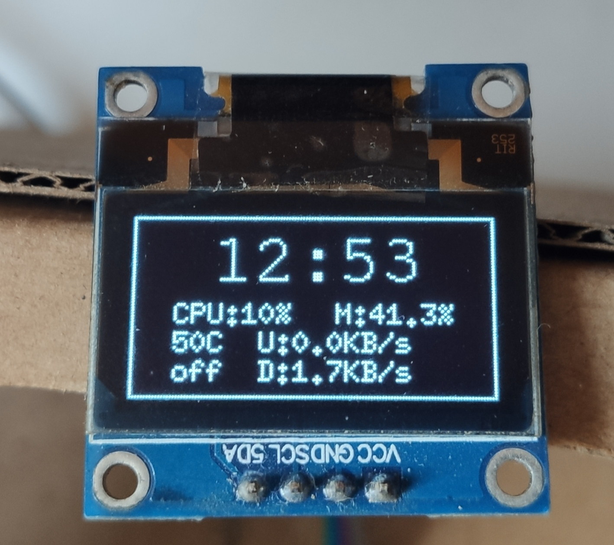

# simple-monitoring
使用闲置的esp8266+ssd1306显示树莓派作为家庭服务器的性能

使用MQTT协议通讯

ssd1306分辨率为128x64

显示时间、cpu占用率、内存占用率、cpu温度、上传速度、下载速度、cpu风扇情况

## MQTT协议
### 系统信息
主题：`/PC`

内容：
Key|备注|实例
-|-|-
time|当前时间|12:53
CPU|CPU使用率|10%
M|内存使用率|41.3%
U|上传速度|0.0KB/s
D|下载速度|1.7KB/s
temp|cpu温度|50C
fen|风扇开启状态|off

示例：
`{"CPU":"10%","M":"41.3%","U":"0.0KB/s","D":"1.7KB/s","temp":"50C","fen":"off","time":"12:53"}`

### WOL
主题：`/ON`

内容：
Key|备注|实例
-|-|-
on|开机|true

示例：
`{"on",true}`